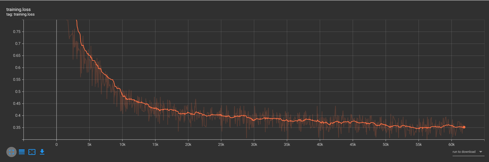
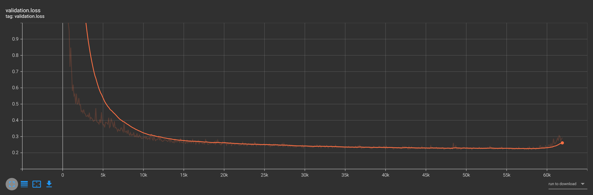

# tacotron2-ch
Tacotron2 is classical tts model. I have change some code from [Nvidia Tacotron2](https://github.com/NVIDIA/tacotron2) to  train  a chinese tts system.Actually the training begin to converge around 8k steps, and the final result is not bad Considering that there is no enough training data。But the final result have not been  state of art.
Also i have provide an onnx inference scripts。

[audio example](audio/audio1.wav)


# training
* Firstly setup a python3.8 envirionment, use conda for example. and install the requirements.
```python
  conda create -n audio python=3.8
  pip install requirements.txt -i https://pypi.doubanio.com/simple
```                                                                                            
* Download the data and start training, the training data if from [baker](https://www.data-baker.com/data/index/TNtts/), and i have change it from 48khz
to 22.05khz by sox.
```bash
    bash train.sh
```
* setup the tensorboad to check the loss, and the tf_logs_dir can be found in the results directory, which is the newest one.

```python
    tensorboard --logdir result/{tf_logs_dir}
```


# jupyter inference
  Refer to inference.ipynb for detail.

# onnx inference 
* export the encoder and decoder to onnx format, the result will be in the root dir for this project.
``` python
    python export_onnx.py ${your check_point}
```

* use tacotron2 to generate mel-bank, and wavglow to generate audio.You can use your sentence in this scripts.
``` python
    python infer_onnx.py
```


# issue
* The validation loss begin to increase after 60k steps, while the training loss still decreases, i think it's because overfitting, if you have any idea, please help me.

<div style="display: flex; flex-direction:row; justify-content: center;">
  
  
</div>